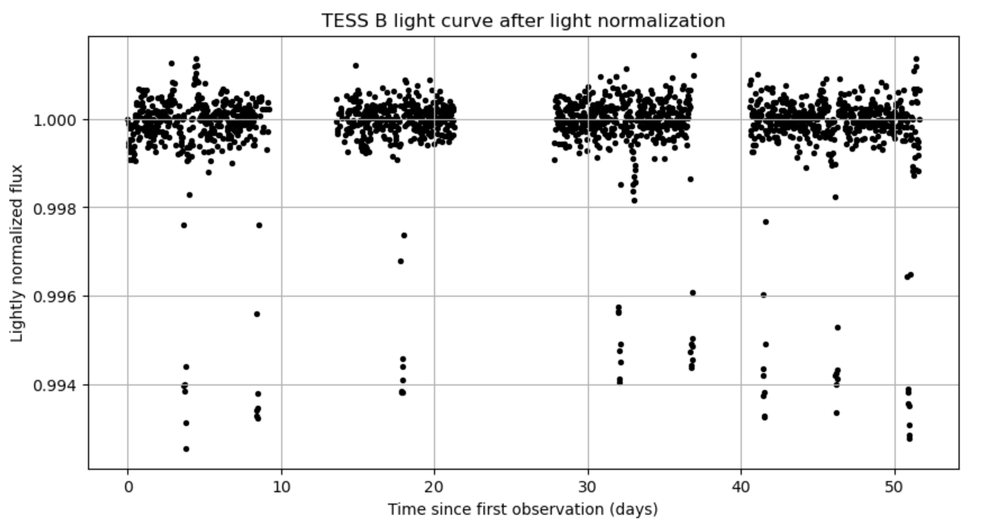
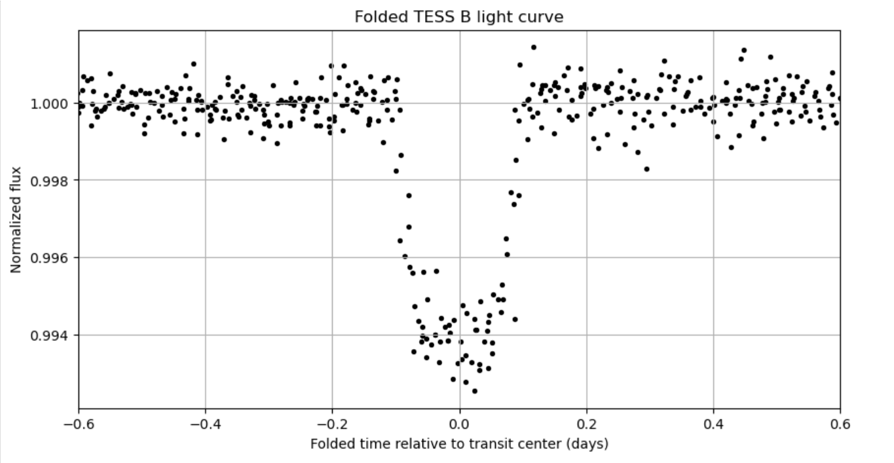
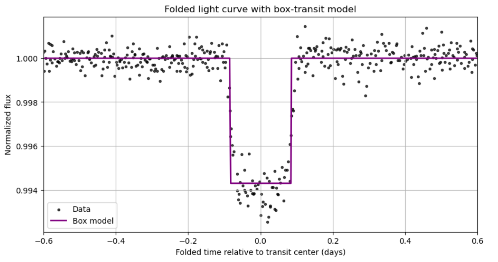

# Exoplanet Transit Orbital Analysis

## Overview

This project analyzes real light curve data from NASA’s TESS mission to detect and characterize an exoplanet using transit photometry. The analysis identifies periodic dips in stellar brightness and estimates key orbital and physical properties of the planet.

---

## Why This Matters

Transit photometry is one of the most important methods used in modern astronomy to discover exoplanets. By measuring small changes in a star’s brightness, it is possible to detect planets, determine their orbital periods, and estimate their sizes and temperatures.

---

## Methods

* Loaded and cleaned time-series light curve data from TESS
* Applied detrending to remove long-term stellar variability
* Identified transit events using flux thresholding
* Estimated orbital period using regression on transit times
* Folded the light curve to enhance periodic signals
* Modeled the transit using a box-shaped function
* Performed residual analysis to evaluate model fit
* Estimated physical parameters using standard orbital relations

---

## Results

* Estimated orbital period: **4.7227 ± 0.0019 days**
* Transit depth: **0.00577 ± 0.00017**
* Transit duration: **4.03 ± 0.03 hours**
* Estimated planet radius: **1.42 ± 0.05 R_J**
* Estimated semi-major axis: **0.0625 ± 0.0011 AU**

The light curve shows consistent periodic dips in brightness, indicating a transiting exoplanet candidate. The derived parameters are consistent with a short-period gas giant (hot Jupiter-type planet).

---

## Result Visualizations

## Normalized Light Curve


### Folded Light Curve


### Transit Model Fit


---

## How to Run

1. Clone the repository
2. Install required Python libraries:

   * NumPy
   * Pandas
   * Matplotlib
   * SciPy
3. Run the notebook:

   ```
   jupyter notebook exoplanet-transit-orbital-analysis.ipynb
   ```

---

## Tools Used

* Python
* NumPy
* Pandas
* Matplotlib
* SciPy

---

## Future Improvements

* Implement a more realistic transit model beyond the box approximation
* Include formal uncertainty propagation and error analysis
* Compare results with confirmed exoplanet catalog values
* Extend analysis to multiple light curves

---

## Author

Danessa Ruff

Michigan State University

